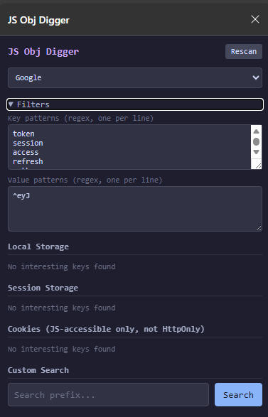

# TokenLeaks

Browser extension that reveals sensitive data exposed to JavaScript — tokens, sessions, and secrets hiding in localStorage, sessionStorage, cookies, and the window object tree.

Scans localStorage, sessionStorage, and JS-accessible cookies for auth tokens, session IDs, JWTs, and other secrets. Also lets you recursively search the entire `window` object tree by prefix, returning all matches found.



## Disclaimer

This project is for educational purposes only. Its goal is to demonstrate that sensitive information like authentication tokens should not be stored in places accessible to JavaScript (localStorage, sessionStorage, non-HttpOnly cookies). The secure approach is to use HttpOnly cookies, which are sent automatically by the browser but cannot be read by any JS running on the page, including extensions and XSS payloads.

## Example

JWT tokens are Base64URL-encoded and always start with `eyJ` (which is `{"` encoded). Open any web app that uses JWTs, type `eyJ` in the extension popup, and it will find all matching tokens along with their exact paths in the JS object tree.

```
path: window.app.auth.session.token (token)
value: eyJhbGciOi..kpXVCJ9aa

path: window.store.user.refreshToken (refreshToken)
value: eyJhbGciOi..xMnR5cCI6
```

## Local setup

1. Clone the repository
2. Run `fnm use` or `nvm use` to switch to the correct Node version
3. Run `npm install` to install type definitions
3. Open `edge://extensions` (or `chrome://extensions`)
4. Enable "Developer mode"
5. Click "Load unpacked" and select the `extension/` folder
6. Open any page, click the extension icon to open the side panel
7. The auto-scan runs immediately on the active tab
8. Use the dropdown to switch to a different tab, or type a prefix and press Enter / click Search

## Type checking

The project uses JSDoc annotations with `@types/chrome` for type safety without TypeScript. Run the type checker with:

```
npx tsc --project extension/jsconfig.json
```
